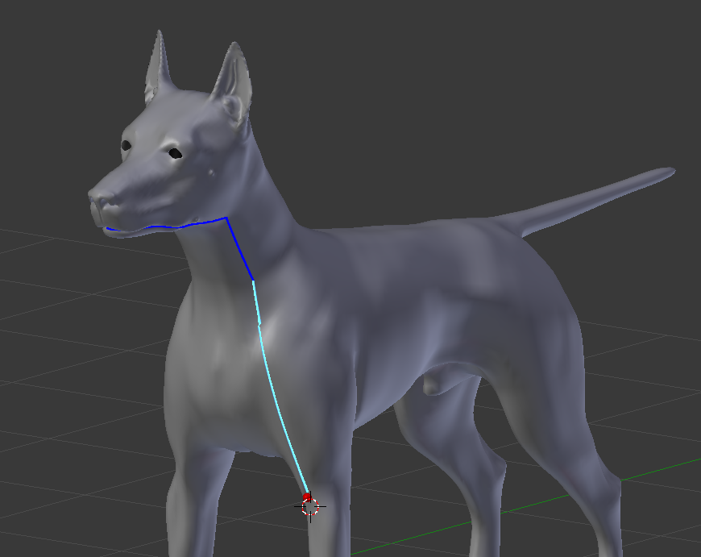
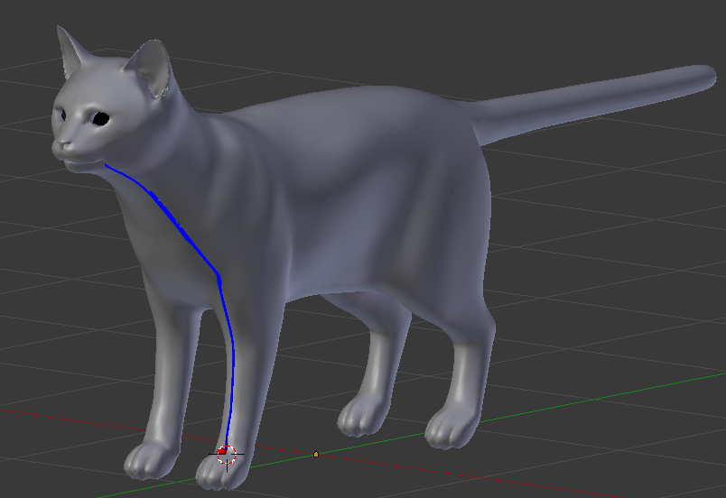
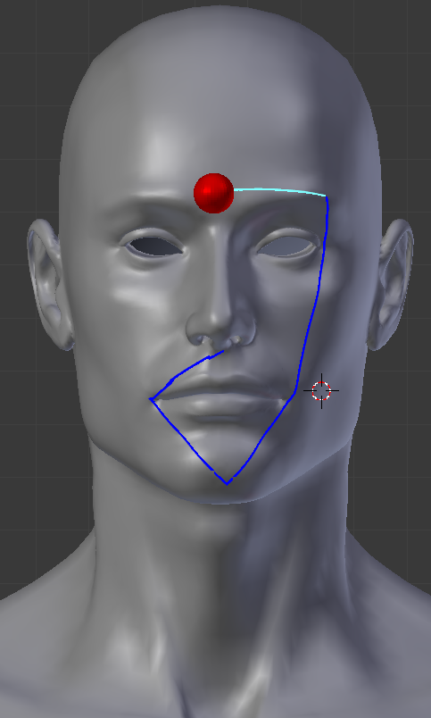

chenhancc
==============

A Fast geodesic algorithm in python that spans across the surface through the polygons

<p>
	
</p>
<p>

Many Thanks
-----------

The original c++ source code was provided to me by Dr. Xin Shiqing (https://sites.google.com/site/xinshiqing/). My sincere thanks to him for his help

The algorithm is purely based on the paper of Shiqing who provided me with this wonderful c++ code as well. All I had to do was make some changes so it can be compiled as a python library. The timing or efficiency difference between the pure python implementation and c++ -> python conversion is atleast 210x times. 
</>

```
Xin SQ, Wang GJ. Improving Chen and Han's algorithm on the discrete geodesic problem. ACM Transactions on Graphics (TOG). 2009 Aug 1;28(4):104.
```

Installation
------------

**Python Package Manager (PIP)**
```pip install chenhancc --user``` 

**Easy Install**
```easy_install --prefix $HOME/.local``` This is for ubuntu 


**Prerequesties**
- This code is compiled using the magic binders for pybind11 created by binder.

	*[Github link for binder](https://github.com/RosettaCommons/binder).
	
	*[Github link for pybind11](https://github.com/pybind/pybind11).


**On any OS (Linux, OS X, MAC, Windows)**

 - clone this repository
 - Ensure to set the variables inside `compile_binder.py`
 - run `python3 compile_binder.py`
 	- arguments and their purpose
 	- `-g`: Generate bindings
 	- `-b`: After generating the bindings compiled it to a python `.so` library
 	- `-t`: Test a short snippet of code to ensure if the library works
 - To install the python library copy the generated chenhann.so (inside autobinding_build) to any locations as:
 	- site-packages of blender
 	- Or use it with any of your personal python projects

License
-------

I haven't thought about it yet. The world is so strange that even free stuffs come at a cost. Did you notice that even for free licenses there are many variants to it? Anyways feel free to do things you want to after cloning the repository. 

Demos
---------

If you want to perform demos as shown in the screenshots above. Then after installing the sharedobject for chenhancc you should be also install another Blender plugin to see live paths on meshes. The link to the repository is [here](https://github.com/aalavandhaann/ch_bl_geodesics). Once you have installed the plugin then start clicking on the meshes and see paths between consecutive clicks. 


Demos - Blender
-------------------

You will find <b>blender</b> folder inside the <b>demo</b> folder. There is a blend file that can test a mesh loaded in the scene. Just ensure to load a mesh, select it with mouse and run the script `(Alt-p)`. You should see a path between the selected vertices as supplied in the code in the text editor of Blender. In the below code change the `svid` and `evid` to change the vertex selection. `svid` is the seed vertex index, and `evid` is the target vertex index to which a path should be found. 

```
#Replace the below Blender api imports with the framework of your choice. 
#The idea is to supply points, and face information for mesh representation
#inside the geodesics algorithm

#----------Blender based api modules import----------------
import bpy, bmesh;
from mathutils import Vector;
#----------End of Blender based api modules import----------------

from chenhancc import CBaseModel as BaseModel, CRichModel as RichModel, CPoint3D as Point3D, CFace as Face, CICHWithFurtherPriorityQueue as ICHWithFurtherPriorityQueue;


c = bpy.context;
m = c.active_object;
svid = 0;
evid = 20000;

def rotate(l, n):
    return l[n:] + l[:n];

def createPathMesh(points):
    myvertexlist = [[2,2,2],[4,4,4],[6,6,6],[8,8,8]]
    
    obName = "path_"+str(len(points));
    me = bpy.data.meshes.new(obName);
    ob = bpy.data.objects.new(obName, me);

    # Get a BMesh representation
    bm = bmesh.new();   # create an empty BMesh
    bm.from_mesh(me);   # fill it in from a Mesh

    # Modify the BMesh, can do anything here...
    for index, co in enumerate(points):
        v = bm.verts.new(co);
        v.index = index;
        
    bm.verts.ensure_lookup_table();
    
    for index, co in enumerate(points[1:]):
        v1 = bm.verts[index-1];
        v2 = bm.verts[index];
        e = bm.edges.new((v1, v2));
        
    
    # also add bm.edges and bm.faces

    # Finish up, write the bmesh back to the mesh
    bm.to_mesh(me);
    bm.free();  # free and prevent further access
    
    scn = bpy.context.scene;
    scn.objects.link(ob);
    scn.objects.active = ob;
    ob.select = True;


if(m):
    verts = [];
    faces = [];
    loops = m.data.loops;
    
    bmodel = RichModel();
    
    m.data.vertices[svid].select = True;
    m.data.vertices[evid].select = True;
    
    for v in m.data.vertices:
        p3d = Point3D(v.co.x, v.co.y, v.co.z);
        verts.append(p3d);
   
    for f in m.data.polygons:
        f_vids = [loops[lid].vertex_index for lid in f.loop_indices];        
        faces.append(Face(f_vids[0], f_vids[1], f_vids[2]));
    
    bmodel.LoadModel(verts, faces);
    bmodel.Preprocess();
    
    emethod = ICHWithFurtherPriorityQueue(bmodel, set([svid]));
    emethod.Execute();
    paths = emethod.FindSourceVertex(evid,[]);
    paths = rotate(paths, 1);
    
    path_verts = [];
    
    for epoint in paths:
        pt = epoint.Get3DPoint(bmodel);
        path_verts.append(Vector((pt.x, pt.y, pt.z)));
    createPathMesh(path_verts);
    print('DONE FOUND THE PATHS::: ');
```